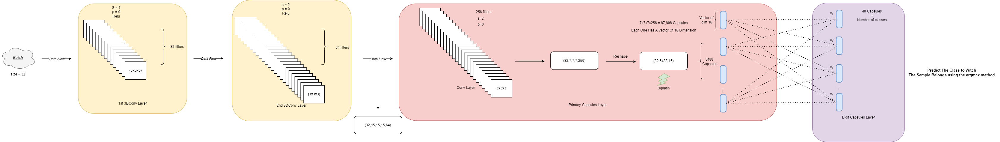

# Création et déploiement d'un modèle de réseaux de neurones à capsules (Capsule Network) avec TensorFlow

## Overview
Ce projet consiste à développer et déployer un modèle de réseau de neurones à capsules (CapsNet) en utilisant TensorFlow. Les réseaux à capsules offrent une alternative aux réseaux convolutifs classiques (CNN) en permettant une meilleure représentation spatiale des objets. L'objectif est de construire un modèle capable de classer des données complexes, notamment des objets en 3D, en tirant parti de la capacité des capsules à conserver les relations hiérarchiques entre les entités. Le projet inclut les étapes de prétraitement des données, la construction du modèle CapsNet, ainsi que l'entraînement et l'évaluation du modèle sur des ensembles de données pertinents.

## Données
Les données sur lesquels on va travailler sont des objects 3d, sous forme des fichiers avec l'extention .off (Object File Format).

### La structure des fichiers .off :
Les fichiers .off (Object File Format) sont utilisés pour décrire des objets 3D, notamment des maillages (mesh) géométriques, qui sont couramment utilisés pour représenter des surfaces tridimensionnelles. Ils sont composés principalement de sommets (vertices) et de faces (faces) qui définissent la géométrie de l'objet.

#### 1. En-tête (Header)
**OFF**

#### 2. Ligne de description
La deuxième ligne contient trois entiers qui décrivent :

Le nombre de sommets (vertices),
Le nombre de faces (faces),
Le nombre d'arêtes (edges).
**<num_vertices> <num_faces> <num_edges>**

#### 3. Liste des sommets (Vertices)
**x1 y1 z1**
**x2 y2 z2**
**...**
**xn yn zn**

#### 4. Liste des faces (Faces)
Les faces sont ensuite décrites par des indices entiers qui font référence aux sommets listés précédemment. Chaque face commence par un entier qui indique le nombre de sommets qui composent cette face (généralement 3 pour les triangles ou 4 pour les quadrilatères), suivi des indices des sommets dans l'ordre correspondant à la face.

**<num_vertices_in_face> v1 v2 v3 ... vn**

##### exemple
3 0 1 2
4 0 1 3 4

La première ligne décrit une face triangulaire (3 sommets) reliant les sommets avec les indices 0, 1, et 2. La seconde ligne décrit une face quadrilatérale (4 sommets) reliant les sommets avec les indices 0, 1, 3, et 4.

#### Exemple complet de la tructure du fichier .off
**OFF**
8 6 0
1.0 0.0 0.0
0.0 1.0 0.0
0.0 0.0 1.0
1.0 1.0 0.0
1.0 0.0 1.0
0.0 1.0 1.0
1.0 1.0 1.0
0.0 0.0 0.0
3 0 1 2
3 1 2 3
3 4 5 6
4 0 3 5 7
3 2 6 7
3 0 4 6

Les donnees sont classe sur 10 classes (Airplane, bathtub, bed, bookshelf, bottle, chair, cone, desk, door, dresser) chaque classe contient des donnees de test et autre d'entrainements.

## Pretraitement
Les donnees sont d'abord pretraite pour etre bien adequat 

